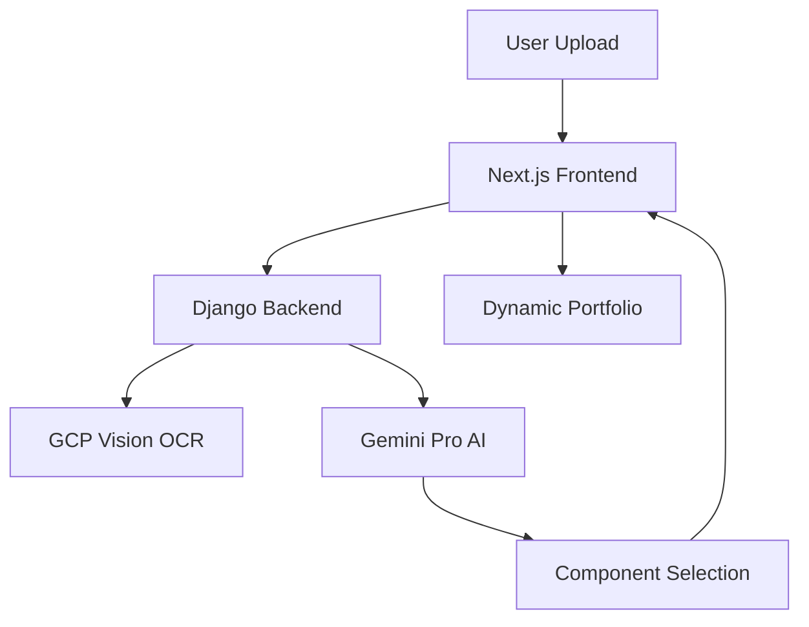

# Design Document: Generative UI Portfolio System

## Overview

The Generative UI Portfolio system is a sophisticated architecture that combines AI-driven analysis with dynamic component rendering to create personalized portfolio websites. The system uses a three-tier architecture: a Next.js 16 frontend with React Server Components, a Django 6.0 async backend for orchestration, and Google Cloud services for AI processing and OCR.

The core innovation lies in treating UI components as "tools" that an AI can select and configure, rather than hardcoding page layouts. This approach enables truly personalized user experiences that adapt to different professional profiles.

## Architecture

### High-Level Architecture



### Component Flow

1. **Ingestion Layer**: Next.js receives file uploads and forwards to Django
2. **Processing Layer**: Django orchestrates OCR extraction and AI analysis
3. **Intelligence Layer**: Gemini Pro analyzes content and selects UI components
4. **Rendering Layer**: Next.js dynamically renders selected components
5. **Presentation Layer**: Generated portfolio with applied themes

### Technology Stack

- **Frontend**: Next.js 16 with App Router and React Server Components
- **Backend**: Django 6.0 with async views and REST framework
- **AI**: Google Gemini Pro with function calling capabilities
- **OCR**: Google Cloud Vision API for text extraction
- **Styling**: Tailwind CSS with dynamic theme variables
- **Animation**: Framer Motion for component transitions
- **Charts**: Recharts for data visualizations

## Components and Interfaces

### Core Components

#### 1. Resume Analysis Engine
- **Input**: PDF/Image files, extracted text content
- **Processing**: Professional categorization, skill extraction, experience parsing
- **Output**: Structured candidate profile with component recommendations

#### 2. Component Toolbox (7 Components)
- **HeroPrism**: Liquid glass header with interactive cursor effects
- **HeroTerminal**: Dark mode terminal with typewriter animations
- **ExpTimeline**: Vertical timeline with connected experience cards
- **ExpMasonry**: Staggered grid layout for creative portfolios
- **SkillDots**: 1-5 glowing neon dot skill indicators
- **SkillRadar**: Hexagonal spider chart for comprehensive skills
- **BentoGrid**: Achievement statistics in bento box layout

#### 3. Component Registry
```typescript
interface ComponentRegistry {
  [key: string]: React.ComponentType<any>;
}

const COMPONENT_MAP: ComponentRegistry = {
  'tool_hero_prism': HeroPrism,
  'tool_hero_terminal': HeroTerminal,
  'tool_exp_timeline': ExpTimeline,
  'tool_exp_masonry': ExpMasonry,
  'tool_skills_dots': SkillDots,
  'tool_skills_radar': SkillRadar,
  'tool_stats_bento': BentoGrid,
};
```

#### 4. Theme Engine
- **Dynamic Palettes**: AI-selected color schemes (neon_blue, emerald_green, cyber_pink)
- **CSS Variables**: Runtime theme application via Tailwind
- **Component Theming**: Consistent styling across all selected components

#### 5. Processing Feedback Components

##### GridScan Background
- **Purpose**: Full-screen WebGL animation providing visual feedback during resume processing
- **Configuration**: Cyan/blue color scheme matching Refolio theme
- **Behavior**: Appears on processing start, fades out on completion
- **Z-Index**: Positioned behind main UI elements (z-index: 0)

##### CountUp Statistics Display
- **Purpose**: Animated number counters showing processing metrics
- **Metrics Displayed**: Characters extracted, skills found, experience years, confidence score
- **Animation**: Smooth easing from 0 to target value
- **Update Trigger**: Values update as processing stages progress

##### CMD Terminal Box (ExtractionTerminal)
- **Purpose**: Real-time display of extracted resume data in terminal aesthetic
- **Position**: Fixed at bottom center of screen
- **Styling**: Glassmorphic (bg-black/80, backdrop-blur-md, border-cyan-500/30)
- **Content Format**: `[HH:MM:SS] [LABEL] extracted_data`
- **Animation**: Typewriter effect for incoming text, fade out on completion

### API Interfaces

#### Django Backend Endpoints
```python
# Resume processing endpoint
POST /api/generate-layout
{
  "file": "resume.pdf",
  "options": {
    "theme_preference": "auto",
    "component_style": "modern"
  }
}

# Response
{
  "components": [
    {
      "type": "tool_hero_prism",
      "props": {
        "theme": "ocean",
        "title": "Senior Backend Developer"
      }
    }
  ],
  "theme": "neon_blue",
  "metadata": {
    "professional_category": "technical",
    "confidence": 0.89
  }
}
```

#### Gemini Function Definitions
```python
tools = [
    {
        "name": "tool_hero_prism",
        "description": "Render liquid glass hero section for general professionals",
        "parameters": {
            "theme": {"type": "string", "enum": ["ocean", "sunset", "forest"]},
            "title": {"type": "string"},
            "subtitle": {"type": "string"}
        }
    },
    {
        "name": "tool_hero_terminal",
        "description": "Render terminal-style hero for technical professionals",
        "parameters": {
            "commands": {"type": "array", "items": {"type": "string"}},
            "theme": {"type": "string", "enum": ["matrix", "cyberpunk", "minimal"]}
        }
    }
    // Additional tool definitions...
]
```

#### Processing Feedback Component Interfaces

```typescript
// GridScan wrapper for processing feedback
interface ProcessingGridScanProps {
  isActive: boolean;
  onFadeComplete?: () => void;
}

// CountUp statistics panel
interface ProcessingStatsProps {
  metrics: ProcessingMetrics;
  isVisible: boolean;
}

// CMD Terminal for extraction stream
interface ExtractionTerminalProps {
  entries: ExtractionEntry[];
  isVisible: boolean;
  isComplete: boolean;
  onFadeComplete?: () => void;
}

// GridScan configuration for Refolio theme
const GRIDSCAN_CONFIG = {
  linesColor: '#164e63',      // cyan-900
  scanColor: '#22d3ee',       // cyan-400
  scanOpacity: 0.6,
  gridScale: 0.15,
  lineStyle: 'solid',
  scanDirection: 'pingpong',
  scanDuration: 2.5,
  scanDelay: 1.0,
  enablePost: true,
  bloomIntensity: 0.3,
  chromaticAberration: 0.001,
};
```

## Data Models

### Candidate Profile
```typescript
interface CandidateProfile {
  id: string;
  name: string;
  title: string;
  professionalCategory: 'creative' | 'technical' | 'corporate' | 'hybrid';
  skills: Skill[];
  experience: Experience[];
  education: Education[];
  projects: Project[];
  contact: ContactInfo;
  extractedText: string;
  confidence: number;
}
```

### Component Configuration
```typescript
interface ComponentConfig {
  type: string;
  props: Record<string, any>;
  order: number;
  theme: string;
}

interface LayoutConfiguration {
  components: ComponentConfig[];
  globalTheme: string;
  metadata: {
    generatedAt: Date;
    aiConfidence: number;
    professionalCategory: string;
  };
}
```

### Resume Processing Result
```typescript
interface ProcessingResult {
  success: boolean;
  candidateProfile: CandidateProfile;
  layoutConfig: LayoutConfiguration;
  processingTime: number;
  errors?: string[];
}
```

### Extraction Stream Data
```typescript
interface ExtractionEntry {
  timestamp: Date;
  label: 'NAME' | 'TITLE' | 'SKILL' | 'EXPERIENCE' | 'EDUCATION' | 'CONTACT' | 'TEXT';
  content: string;
}

interface ProcessingMetrics {
  charactersExtracted: number;
  skillsFound: number;
  experienceYears: number;
  confidenceScore: number;
}

interface ProcessingFeedbackState {
  isProcessing: boolean;
  stage: 'uploading' | 'extracting' | 'analyzing' | 'generating' | 'complete';
  progress: number;
  metrics: ProcessingMetrics;
  extractionStream: ExtractionEntry[];
  showGridScan: boolean;
  showTerminal: boolean;
}
```
## C
orrectness Properties

*A property is a characteristic or behavior that should hold true across all valid executions of a system-essentially, a formal statement about what the system should do. Properties serve as the bridge between human-readable specifications and machine-verifiable correctness guarantees.*

### Property Reflection

After analyzing all acceptance criteria, several properties can be consolidated to eliminate redundancy:

- Properties 2.1, 2.2, 2.3, 2.4 (creative component selection) can be combined into a comprehensive creative profile property
- Properties 3.1, 3.2, 3.3, 3.4 (technical component selection) can be combined into a comprehensive technical profile property  
- Properties 6.1 and 6.2 (PDF and image processing) can be combined into a general file processing property
- Properties 4.1 and 4.2 (indicator identification and mapping) can be combined into a single professional analysis property

### Core Properties

**Property 1: OCR Text Extraction Consistency**
*For any* PDF or image file containing text, the OCR extraction should preserve the textual content accurately, allowing for minor formatting differences
**Validates: Requirements 1.1, 6.1, 6.2**

**Property 2: Professional Categorization Accuracy**  
*For any* resume with clear professional indicators, the system should classify the candidate into the correct professional category (creative, technical, corporate, hybrid)
**Validates: Requirements 1.2, 4.1, 4.2**

**Property 3: Creative Profile Component Selection**
*For any* candidate classified as creative, the system should select creative-appropriate components (masonry layouts, prism heroes, neon dots, gallery elements)
**Validates: Requirements 2.1, 2.2, 2.3, 2.4**

**Property 4: Technical Profile Component Selection**
*For any* candidate classified as technical, the system should select technical-appropriate components (terminal heroes, timeline layouts, radar charts)
**Validates: Requirements 3.1, 3.2, 3.3, 3.4**

**Property 5: Component Rendering Completeness**
*For any* list of selected components, the portfolio generator should render all components in the correct order with proper configuration
**Validates: Requirements 1.4, 5.2, 5.4**

**Property 6: Theme Consistency Application**
*For any* generated portfolio, all components should use colors and styling from the same cohesive theme palette
**Validates: Requirements 1.5**

**Property 7: Component Registry Integrity**
*For any* AI tool call, the component registry should have a corresponding React component mapping that renders without errors
**Validates: Requirements 5.1, 5.2**

**Property 8: Fallback Behavior Reliability**
*For any* ambiguous or invalid input, the system should provide default component selections rather than failing or producing empty output
**Validates: Requirements 4.4, 6.4**

**Property 9: Format Flexibility Handling**
*For any* resume with non-standard section ordering or structure, the system should extract relevant information and generate appropriate components
**Validates: Requirements 6.3**

**Property 10: System Extensibility Preservation**
*For any* addition of new components to the toolbox, existing component rendering and selection logic should continue to function correctly
**Validates: Requirements 5.3**

**Property 11: Progress Feedback Emission**
*For any* resume processing operation, the system should emit progress events at key processing milestones
**Validates: Requirements 7.1**

**Property 12: Non-blocking Theme Application**
*For any* theme change operation, the UI should remain responsive and not block user interactions during theme application
**Validates: Requirements 7.4**

**Property 13: GridScan Lifecycle Management**
*For any* resume processing operation, the GridScan component should be visible during processing and hidden after completion
**Validates: Requirements 8.1, 8.3**

**Property 14: GridScan Theme Consistency**
*For any* GridScan instance displayed during processing, the scan and line colors should match the Refolio cyan/blue theme palette
**Validates: Requirements 8.2**

**Property 15: CountUp Metrics Synchronization**
*For any* processing stage transition, the CountUp components should display values that correspond to the actual extracted metrics
**Validates: Requirements 9.1, 9.2, 9.3**

**Property 16: Terminal Entry Formatting**
*For any* extraction entry displayed in the CMD terminal, the entry should contain a valid timestamp and a recognized data type label
**Validates: Requirements 10.2, 10.3**

**Property 17: Terminal Lifecycle Management**
*For any* extraction operation, the terminal should appear when extraction begins and display a completion message before fading out
**Validates: Requirements 10.1, 10.5**

## Error Handling

### Input Validation
- **File Type Validation**: Accept only PDF and common image formats (PNG, JPG, JPEG)
- **File Size Limits**: Enforce reasonable file size limits (10MB max) to prevent resource exhaustion
- **Content Validation**: Verify extracted text contains meaningful content before analysis

### Processing Error Recovery
- **OCR Failures**: Provide manual text input option when OCR fails
- **AI Analysis Timeouts**: Implement timeout handling with fallback to default component selection
- **Component Rendering Errors**: Graceful degradation to basic components when advanced components fail

### Fallback Strategies
- **Unknown Professional Category**: Default to hybrid profile with balanced component selection
- **Missing Component Mappings**: Fall back to basic component alternatives
- **Theme Application Failures**: Revert to default theme with error logging

### Error Reporting
- **User-Friendly Messages**: Translate technical errors into actionable user guidance
- **Detailed Logging**: Comprehensive error logging for debugging and system monitoring
- **Retry Mechanisms**: Automatic retry for transient failures (network, API rate limits)

## Testing Strategy

### Dual Testing Approach

The system requires both unit testing and property-based testing to ensure comprehensive coverage:

**Unit Tests** verify specific examples, edge cases, and integration points:
- Component rendering with specific props
- API endpoint responses with known inputs  
- Error handling with invalid inputs
- Theme application with specific color palettes

**Property-Based Tests** verify universal properties across all inputs:
- OCR accuracy across randomly generated documents
- Professional categorization consistency across varied resume content
- Component selection logic across different professional profiles
- Theme consistency across all possible component combinations

### Property-Based Testing Framework

**Framework**: We will use **Hypothesis** for Python (Django backend) and **fast-check** for TypeScript (Next.js frontend)

**Configuration**: Each property-based test will run a minimum of 100 iterations to ensure statistical confidence in the results

**Test Tagging**: Each property-based test will include a comment with the format:
`**Feature: generative-ui-portfolio, Property {number}: {property_text}**`

### Testing Requirements

- **Unit Tests**: Focus on specific component behavior, API contracts, and error conditions
- **Property Tests**: Verify correctness properties hold across all valid inputs
- **Integration Tests**: End-to-end testing of the complete resume-to-portfolio pipeline
- **Performance Tests**: Validate processing times and resource usage under load
- **Visual Regression Tests**: Ensure component rendering consistency across updates

### Test Data Strategy

- **Synthetic Resume Generation**: Create varied resume content for testing different professional profiles
- **Component Configuration Generation**: Generate random but valid component selections for rendering tests
- **Theme Variation Testing**: Test all theme combinations across all component types
- **Edge Case Coverage**: Test boundary conditions like empty resumes, corrupted files, and extreme content lengths